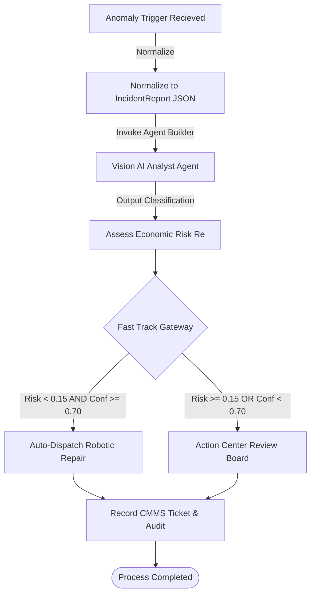

# Container 1 — Problem Report / Anomaly Intake

This container models and orchestrates the initial stages of the **Autonomous Robotics Field Inspection & CMII-Based Engineering Change Management** workflow. 

It receives raw events from multiple telemetry platforms, normalizes them, runs cognitive classification, calculates risks, and gates decisions between **Fast Track (Fully Autonomous)** execution and **Full Track (Human-in-the-Loop Action Center)** review.

## File Contents

- [problem_report.bpmn](file:///home/macb/hackathons/uipath-maestro-ecm/artifacts/container1/problem_report.bpmn): The main process diagram conformant to BPMN 2.0. Defines lanes, service/user task nodes, gateways, and transition flows.
- [agent_analyst.yaml](file:///home/macb/hackathons/uipath-maestro-ecm/artifacts/container1/agent_analyst.yaml): Playbook prompt, safety constraints, and engine properties for the UiPath Agent Builder Classification Agent.
- [action_center_irb.json](file:///home/macb/hackathons/uipath-maestro-ecm/artifacts/container1/action_center_irb.json): Action Center human-review task form schema and transition disposition types.

---

## Architectural Process Flow



---

## Key Interfaces & Data Shapes

### 1. Unified Intake Schema
All raw inputs are normalized by adapters to match the [incident_report.schema.json](file:///home/macb/hackathons/uipath-maestro-ecm/samples/triggers/incident_report.schema.json) specification. This includes:
- `incidentId`: Unique tracking key (e.g., `IR-20260520-0001`).
- `source`: Type (vision, erp, manual, supplier) + sensor confidence score.
- `severity`: Source's initial assessment.
- `affectedItems`: Plotted BOM line numbers and external supplier identification.
- `complianceClass`: Regulated industry identifiers (e.g., `AS9100`, `ISO10007`).

### 2. Cognitive Analyst Model (`agent_analyst.yaml`)
- **LLM Engine**: Claude 3.5 Sonnet (optimized for vision telemetry text parsing).
- **Classification Output Categories**:
  - `STRUCTURAL_DEFECT`: Physical cracks, panel spacing, or frame variances.
  - `WIRING_FAULT`: Misrouted cables, short circuits, or exposed connections.
  - `COMMODITY_VARIANCE`: Metal market index shocks or raw material deviations.
  - `OPERATIONAL_RISK`: General assembly/operational issues.
- **Safety Risk score (Re)** is computed based on severity + compliance rules.

### 3. Gateway Rule Criteria
The Exclusive Gateway decides whether to process the incident autonomously or route it to Action Center:
```javascript
// Route to Action Center if Risk >= 15% OR AI Confidence < 70%
if (riskScore >= 0.15 || analystConfidence < 0.70) {
    routeTo("Action Center - Compliance Review Board");
} else {
    routeTo("Fast Track - Robotic Repair Auto-Dispatch");
}
```

### 4. Human-In-The-Loop Sign-Off (`action_center_irb.json`)
When gated to the **Compliance Review Board (CRB)**, a task is created on UiPath Action Center displaying read-only AI analytics, and requiring the human to:
1. Choose a final disposition (`APPROVE_REWORK`, `APPROVE_SCRAP`, `INITIATE_AUDIT`, `HOLD_PRODUCTION`, `OVERRIDE_TO_PROCEED`).
2. Provide a mandatory, audit-logged text explanation (`reviewerNotes`, minimum 10 characters).
3. Append their authorized e-signature (`reviewerName`).
