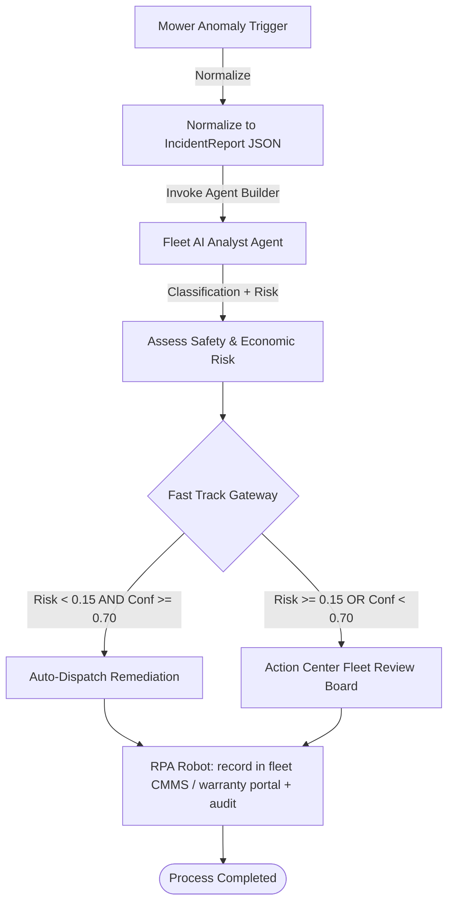

# Container 1 — Incident Report / Anomaly Intake

This container models and orchestrates the initial stages of the **Robotic Lawn-Mower Fleet
Incident Triage & Remediation** workflow.

It receives raw events from multiple trigger platforms (onboard vision, IMU/lidar sensors,
fleet telemetry, operator handheld), normalizes them to one canonical `IncidentReport`, runs
agentic classification, computes a safety-risk score, and gates decisions between **Fast Track
(Fully Autonomous)** execution and **Full Track (Human-in-the-Loop Action Center)** review.

## File Contents

- [problem_report.bpmn](./problem_report.bpmn): The main process diagram conformant to BPMN 2.0. Defines lanes, service/user task nodes, gateways, and transition flows.
- [agent_analyst.yaml](./agent_analyst.yaml): Playbook prompt, safety constraints, and engine properties for the UiPath Agent Builder Fleet AI Analyst.
- [action_center_irb.json](./action_center_irb.json): Action Center human-review task form schema and disposition types.

---

## Architectural Process Flow



---

## Key Interfaces & Data Shapes

### 1. Unified Intake Schema
All raw inputs are normalized by adapters to match the [incident_report.schema.json](../../samples/triggers/incident_report.schema.json) specification. This includes:
- `incidentId`: Unique tracking key (e.g., `IR-20260607-0001`).
- `source`: Type (vision, sensor, telemetry, manual) + detector confidence score.
- `severity`: Source's initial assessment.
- `affectedItems`: Mower units / parts / modules implicated.
- `safetyZone`: Operating zone (e.g., `near-road`, `near-water`, `public-access`, `steep-slope`).

### 2. Cognitive Analyst Model (`agent_analyst.yaml`)
- **LLM Engine**: Claude (primary), Gemini (fallback) via UiPath Agent Builder.
- **Classification Output Categories**:
  - `BLADE_FAULT`: Blade strike, jam, debris in the cutting deck.
  - `MOBILITY_FAULT`: Stall, wheel slip, tilt/rollover risk, drivetrain.
  - `BOUNDARY_BREACH`: Geofence crossing, RTK/GPS drift, off-property.
  - `OPERATIONAL_RISK`: Charging, theft/anti-theft, general operational issues.
- **Safety Risk score** is computed from severity + detector confidence + operating zone.

### 3. Gateway Rule Criteria
The Exclusive Gateway decides whether to process the incident autonomously or route it to Action Center:
```javascript
// Route to Action Center if Risk >= 15% OR AI Confidence < 70%
if (riskScore >= 0.15 || analystConfidence < 0.70) {
    routeTo("Action Center - Fleet Review Board");
} else {
    routeTo("Fast Track - Autonomous Remediation");
}
```

### 4. Human-In-The-Loop Sign-Off (`action_center_irb.json`)
When gated to the **Fleet Review Board**, a task is created on UiPath Action Center displaying read-only AI analytics, and requiring the human to:
1. Choose a final disposition (`APPROVE_SERVICE`, `RECALL_UNIT`, `INITIATE_INSPECTION`, `HOLD_UNIT`, `OVERRIDE_TO_PROCEED`).
2. Provide a mandatory, audit-logged text explanation (`reviewerNotes`, minimum 10 characters).
3. Append their authorized e-signature (`reviewerName`).
