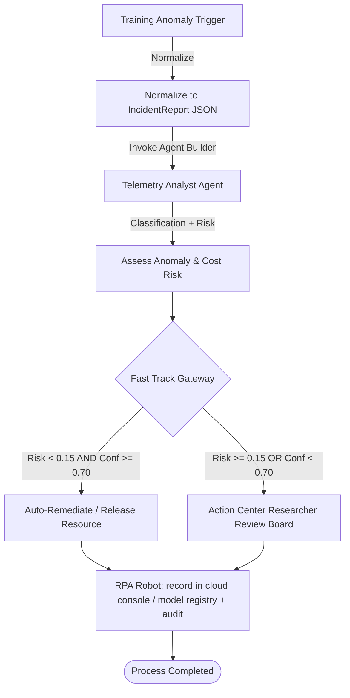

# Container 1 — Anomaly Report / Intake

This container models and orchestrates the initial stages of the **Humanoid RL Training-Fleet
Anomaly Triage & Remediation** workflow.

It receives raw events from multiple sources (reward/loss telemetry, container logs, a hardware
monitor, a researcher console), normalizes them to one canonical `IncidentReport`, runs agentic
classification, computes an anomaly-risk score, and gates decisions between **Fast Track
(Fully Autonomous)** execution and **Full Track (Human-in-the-Loop Action Center)** review.

## File Contents

- [problem_report.bpmn](./problem_report.bpmn): The main process diagram conformant to BPMN 2.0. Defines lanes, service/user task nodes, gateways, and transition flows.
- [agent_analyst.yaml](./agent_analyst.yaml): Playbook prompt, constraints, and engine properties for the UiPath Agent Builder Telemetry Analyst.
- [action_center_irb.json](./action_center_irb.json): Action Center human-review task form schema and disposition types.

---

## Architectural Process Flow



---

## Key Interfaces & Data Shapes

### 1. Unified Intake Schema
All raw inputs are normalized by adapters to match the [incident_report.schema.json](../../samples/triggers/incident_report.schema.json) specification. This includes:
- `incidentId`: Unique tracking key (e.g., `IR-20260607-0001`).
- `source`: Type (telemetry, logs, monitor, manual) + detector confidence score.
- `severity`: Source's initial assessment.
- `affectedItems`: Training jobs / GPU instances / cloud accounts implicated.
- `safetyZone`: Criticality zone (e.g., `high-cost-gpu`, `production-bound`, `public-benchmark`, `long-running`).

### 2. Cognitive Analyst Model (`agent_analyst.yaml`)
- **LLM Engine**: Claude (primary), Gemini (fallback) via UiPath Agent Builder.
- **Classification Output Categories**:
  - `GRADIENT_COLLAPSE`: Reward flatlined/collapsed, gradients vanished, NaN, plateau.
  - `LOSS_DIVERGENCE`: Loss diverging, reward crashing, unstable/exploding training.
  - `HARDWARE_FAULT`: CUDA OOM, GPU thermal/overheat, throttling, instance/node failure.
  - `RESOURCE_RISK`: Idle spend, quota/budget, general operational issues.
- **Anomaly Risk score** is computed from severity + detector confidence + criticality zone.

### 3. Gateway Rule Criteria
The Exclusive Gateway decides whether to process the anomaly autonomously or route it to Action Center:
```javascript
// Route to Action Center if Risk >= 15% OR AI Confidence < 70%
if (riskScore >= 0.15 || analystConfidence < 0.70) {
    routeTo("Action Center - Researcher Review Board");
} else {
    routeTo("Fast Track - Autonomous Remediation");
}
```

### 4. Human-In-The-Loop Sign-Off (`action_center_irb.json`)
When gated to the **Researcher Review Board**, a task is created on UiPath Action Center displaying read-only AI analytics, and requiring the human to:
1. Choose a final disposition (`APPROVE_RESTART`, `TERMINATE_RUN`, `INITIATE_INSPECTION`, `HOLD_RUN`, `OVERRIDE_TO_PROCEED`).
2. Provide a mandatory, audit-logged text explanation (`reviewerNotes`, minimum 10 characters).
3. Append their authorized e-signature (`reviewerName`).
