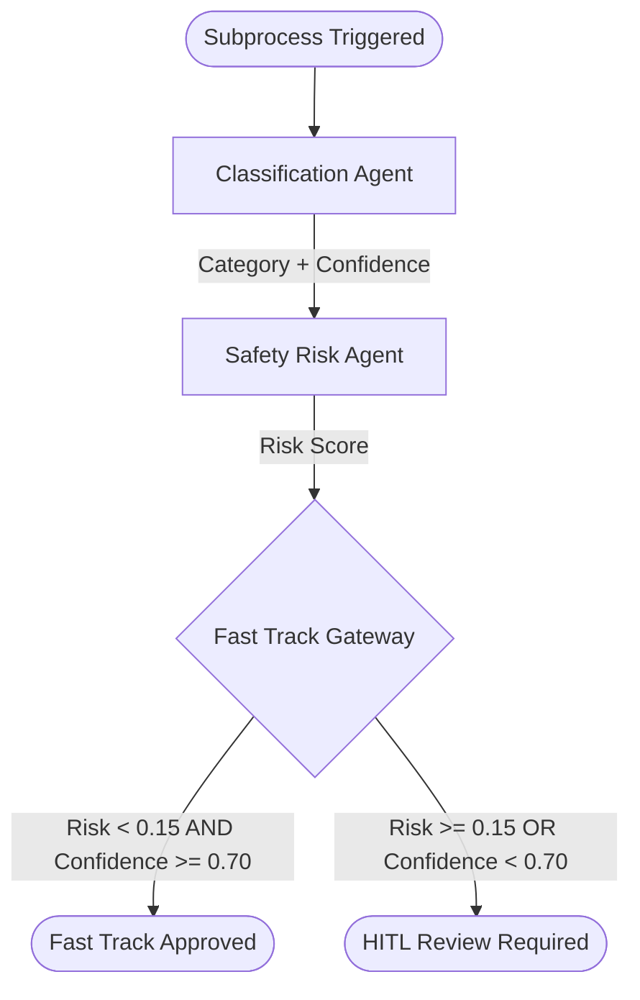

# Container 2 — Analysis & Safety Routing Subprocess

This container models and orchestrates the automated classification and safety risk analysis of lawn-mower fleet incidents.

It separates the cognitive logic into two specialized AI agents to ensure modularity, traceability, and high reliability in decision-making:
1. **Classification Agent**: Categorizes the type of incident.
2. **Safety Risk Agent**: Computes the numerical safety risk score.

A downstream **Fast-Track Gateway** evaluates these values and decides whether to route the incident for fully autonomous resolution or flags it for human oversight.

## File Contents

- [analysis_routing.bpmn](./analysis_routing.bpmn): The subprocess diagram conformant to BPMN 2.0. Defines swimlanes, agent tasks, gateways, and transition flows.
- [agent_classification.yaml](./agent_classification.yaml): Configuration for the Classification Agent (Agent Builder).
- [agent_risk.yaml](./agent_risk.yaml): Configuration for the Safety Risk Agent (Agent Builder).

---

## Architectural Process Flow

---

## Key Interfaces & Data Shapes

### 1. Classification Agent (`agent_classification.yaml`)
- **Inputs**: Canonical `IncidentReport` JSON.
- **Outputs**:
  - `incidentId` (string)
  - `category`: Map to exactly one of `BLADE_FAULT`, `MOBILITY_FAULT`, `BOUNDARY_BREACH`, `OPERATIONAL_RISK`.
  - `confidence` (number 0.0 to 1.0): Classification confidence.
  - `reasoning` (string): Cognitive step-by-step logic.

### 2. Safety Risk Agent (`agent_risk.yaml`)
- **Inputs**: Canonical `IncidentReport` JSON.
- **Rules (1:1 Modeling)**:
  - Baseline risk = `0.05`.
  - Severity modifier: Add `0.50` for `critical`, `0.25` for `high`, `0.10` for `medium`.
  - Detector confidence modifier: Add `0.15` if `source.detectorConfidence < 0.8`.
  - Operating zone factor: Multiply by `1.5` if `safetyZone` is `near-road`, `near-water`, `public-access`, or `steep-slope`.
  - Clamp results between `0.0` and `1.0`.
- **Outputs**:
  - `incidentId` (string)
  - `riskScore` (number 0.0 to 1.0)
  - `reasoning` (string)

### 3. Gateway Rule Logic
The Exclusive Gateway uses the outputs of the Classification Agent (`confidence`) and Safety Risk Agent (`riskScore`) to route:
- **Fast Track (Autonomous)**: `${riskScore < 0.15 && confidence >= 0.70}`
- **Full Track (HITL)**: `${riskScore >= 0.15 || confidence < 0.70}`
