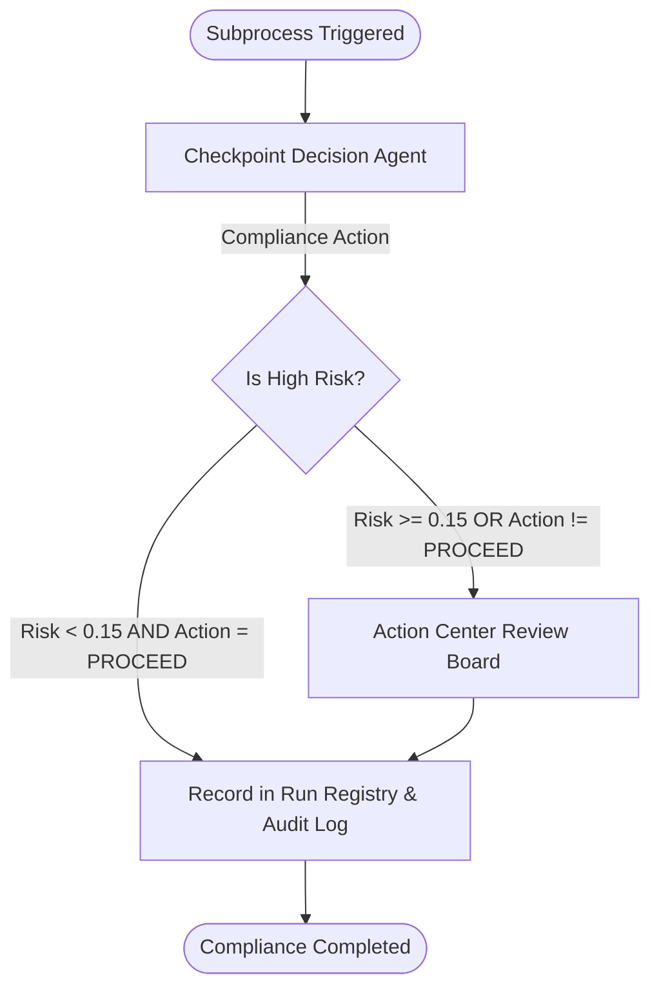

# Container 3 — Decision & Compliance Subprocess

This container handles the decision-making and compliance enforcement for humanoid RL
training-fleet anomalies.

It uses an autonomous **Checkpoint Decision Agent** to map classified anomalies to remediation/compliance actions, and delegates high-risk or high-impact choices to human stakeholders via the **Action Center Review Board**.

## File Contents

- [decision_compliance.bpmn](./decision_compliance.bpmn): The subprocess diagram conformant to BPMN 2.0. Defines swimlanes, agent tasks, gateways, and transition flows.
- [agent_decision.yaml](./agent_decision.yaml): Configuration playbook for the Checkpoint Decision Agent (Agent Builder).
- [action_center_review_board.json](./action_center_review_board.json): Action Center human-review task form schema and disposition types for the compliance review board.

---

## Architectural Process Flow

---

## Key Interfaces & Data Shapes

### 1. Checkpoint Decision Agent (`agent_decision.yaml`)
- **Inputs**: Normalized `IncidentReport` JSON, anomaly category, and risk score.
- **Compliance Actions**:
  - `RETUNE`: Recoverable run — adjust hyperparameters and relaunch.
  - `DISCARD`: Unrecoverable run/checkpoint — throw it away.
  - `VALIDATE`: Metrics/checkpoint need verification/calibration before trusting them.
  - `HOLD`: Pause/quarantine the run (stop spend / protect a production-bound model).
  - `PROCEED`: Resume training.
- **Outputs**:
  - `incidentId` (string)
  - `complianceAction`: One of the 5 values above.
  - `reasoning` (string): Cognitive justification.

### 2. High-Risk Rule Criteria
The Exclusive Gateway checks if the anomaly meets compliance review requirements:
- **High-Risk (Requires Review Board)**: `${riskScore >= 0.15 || complianceAction != 'PROCEED'}`
- **Low-Risk (Auto-logs and completes)**: `${riskScore < 0.15 && complianceAction == 'PROCEED'}`

### 3. Human-In-The-Loop Sign-Off (`action_center_review_board.json`)
For high-risk reviews, a task is created on UiPath Action Center displaying read-only context (incident ID, category, risk score, proposed action, and AI reasoning) and requiring:
1. Final disposition (`APPROVE_RETUNE`, `APPROVE_DISCARD`, `APPROVE_VALIDATE`, `APPROVE_HOLD`, `APPROVE_PROCEED`, `OVERRIDE_TO_PROCEED`, `OVERRIDE_TO_HOLD`).
2. Mandatory, audit-logged text explanation (`reviewerNotes`, minimum 10 characters).
3. Authorized signature (`reviewerName`).
4. Compliance Work Order ID (`workOrderId` pattern matching `WO-YYYY-NNNN+`).
